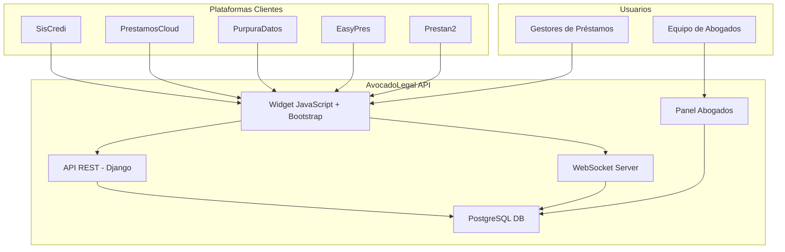
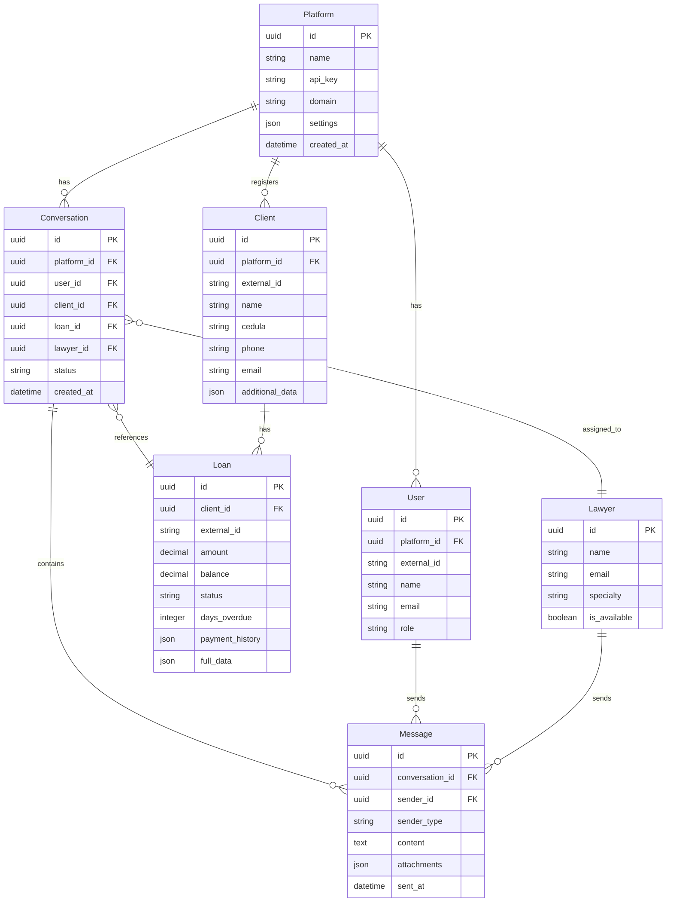
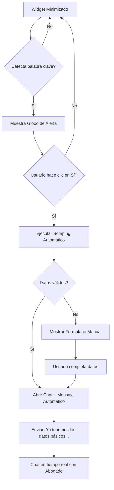

# AvocadoLegal API - Product Requirements Document (PRD) & Implementation Plan

## 📋 Executive Summary

**Nombre Interno:** AvocadoLegal  
**Nombre Frontend:** JCJ Consultings  
**Cliente:** JCJ Consultings (Oficina de Abogados)  
**Mercado Objetivo:** Plataformas SaaS de gestión de préstamos en República Dominicana

### Vision del Producto
Una API que proporciona un widget de chat embebible para plataformas de gestión de préstamos, conectando automáticamente a usuarios con un equipo de abogados especializados en cobranzas cuando se detectan préstamos en estado irregular.

---

## ✅ Decisiones Confirmadas

| Aspecto | Decisión |
|---------|----------|
| **API Keys** | Única por plataforma, registro automático con fallback manual |
| **Abogados iniciales** | 2, con sistema escalable de turnos |
| **Notificaciones** | Email + Push, chat en tiempo real |
| **WhatsApp** | No incluido en MVP, contacto manual posterior |
| **Historial** | Persistente hasta cierre del caso por abogado |
| **Branding** | JCJ Consultings (pendiente assets) |

---

## 🎯 Objetivos del Proyecto

| Objetivo | Métrica de Éxito |
|----------|------------------|
| Detección automática de préstamos irregulares | 95% de precisión en detección |
| Integración sencilla con SaaS externos | < 5 líneas de código para integrar |
| Respuesta legal rápida | < 2 min tiempo de respuesta inicial |
| Recopilación integral de datos | 100% de datos del préstamo capturados |

---

## 🏗️ Arquitectura del Sistema



---

## 🔧 Stack Tecnológico

| Componente | Tecnología | Justificación |
|------------|------------|---------------|
| **Backend** | Django 6.0 + Django REST Framework | Última versión estable, robusto, tu experiencia |
| **Base de Datos** | PostgreSQL 16 | Soporte JSON, full-text search, escalable |
| **Real-time** | Django Channels 4.3.2 + WebSockets | Chat en tiempo real integrado con Django |
| **Frontend Widget** | JavaScript + Bootstrap 5.3.8 | Estilos consistentes, responsivo, familiar |
| **Cache** | Redis 7 | Sesiones, colas de mensajes, channels layer |
| **Servidor** | Daphne/Uvicorn | Soporte ASGI para WebSockets |

---

## 📦 Componentes del Sistema

### 1. Widget Embebible (JavaScript + Bootstrap 5.3.8)

**Funcionalidades:**
- Popup sticky configurable (esquina inferior izquierda o derecha)
- Detección de palabras clave en el DOM
- Notificación con "globo" al detectar irregularidad
- Chat responsivo que se adapta al estilo del host
- Scraping automático de datos con fallback a formulario manual

**Palabras Clave de Detección:**
```
"retraso", "atraso", "mora", "vencido", "vencida", 
"cobranza", "legal", "acuerdo de pago", "irregular", 
"pendiente", "incumplimiento", "embargo", "intimación",
"consolidación", "reestructuración", "refinanciamiento",
"demanda", "judicial", "notificación legal"
```

**Placeholder para Chat Vacío:**
> "¡Conoce al increíble equipo de Abogados detrás de JCJ Consultings! Serán tus nuevos consultores legales de confianza. [¡Visítanos!](https://jcjconsultings.com)"

### 2. API REST (Django)

**Endpoints Principales:**

| Método | Endpoint | Descripción |
|--------|----------|-------------|
| POST | `/api/v1/auth/register/` | Registrar nueva plataforma cliente |
| POST | `/api/v1/auth/token/` | Obtener token de acceso |
| POST | `/api/v1/conversations/` | Iniciar nueva conversación |
| GET | `/api/v1/conversations/{id}/` | Obtener conversación |
| POST | `/api/v1/conversations/{id}/messages/` | Enviar mensaje |
| POST | `/api/v1/loans/analyze/` | Analizar préstamo |

### 3. Sistema de WebSockets

**Canales:**
- `conversation_{id}` - Chat en tiempo real
- `notifications_{platform_id}` - Alertas para plataforma
- `lawyers_queue` - Cola de casos para abogados

### 4. Panel de Administración (Abogados)

**Vistas:**
- Dashboard con métricas
- Lista de conversaciones activas
- Historial de casos
- Gestión de plantillas de respuestas

---

## 📊 Modelos de Datos



---

## 🔐 Seguridad

| Aspecto | Implementación |
|---------|----------------|
| Autenticación de Plataformas | API Keys + JWT Tokens |
| CORS | Whitelist de dominios registrados |
| Rate Limiting | 100 req/min por plataforma |
| Encriptación | HTTPS obligatorio, datos sensibles hasheados |
| Validación | Serializers Django REST Framework |

---

## 🎨 UI/UX del Widget

### Estados del Widget:

1. **Minimizado:** Icono flotante en esquina inferior (configurable: izquierda/derecha)
2. **Alerta:** Globo con mensaje de irregularidad detectada y botones "Sí"/"No"
3. **Recopilando Datos:** Spinner + scraping automático (o formulario si falla)
4. **Chat Abierto:** Panel de chat expandido con mensaje de bienvenida automático
5. **Cargando:** Spinner mientras se conecta con abogado

### Flujo de Interacción:



### Mensaje Automático de Bienvenida:
> "¡Hola! Ya tenemos los datos básicos del préstamo. ¿Cuál es tu consulta y qué procedimiento te gustaría iniciar?"

### Estilos CSS (Variables Personalizables):
```css
:root {
  --jcj-primary: #1a365d;
  --jcj-secondary: #2b6cb0;
  --jcj-accent: #48bb78;
  --jcj-background: #ffffff;
  --jcj-text: #2d3748;
  --jcj-border-radius: 12px;
}
```

---

## 🔌 Estrategia de Integración y Recopilación de Datos

> [!NOTE]
> Implementamos un **enfoque inteligente de 2 fases**: primero scraping automático, luego formulario manual si los datos son insuficientes.

### Flujo de Recopilación de Datos:

1. **Fase 1: Scraping Automático**
   - Al hacer clic en "Sí", el widget intenta extraer datos del DOM
   - Busca patrones comunes: tablas, labels, clases CSS típicas
   - Evalúa la calidad de los datos obtenidos

2. **Fase 2: Formulario Manual (Fallback)**
   - Si el scraping no obtiene datos suficientes, muestra formulario
   - Pre-llena con datos parciales del scraping
   - Usuario confirma/completa la información

3. **Mensaje Automático de Bienvenida**
   - Una vez obtenidos los datos, envía mensaje automático:
   - *"¡Hola! Ya tenemos los datos básicos del préstamo. ¿Cuál es tu consulta y qué procedimiento te gustaría iniciar?"*

4. **JavaScript API para Plataformas Avanzadas**
   ```javascript
   // La plataforma puede enviar datos programáticamente
   JCJLegal.setLoanData({
     client: { name: "Juan", cedula: "001-0000000-0" },
     loan: { amount: 50000, status: "mora", days_overdue: 45 }
   });
   ```

**Ventajas:**
- ✅ Intenta automatizar primero, reduce fricción
- ✅ Fallback garantiza que siempre funcione
- ✅ Plataformas pueden pre-poblar vía API
- ✅ Mensaje automático acelera la conversación

---

## Proposed Changes

### Core Backend (Django)

#### [NEW] `C:\Users\carlo\AvocadoLegal\` - Proyecto Django Principal

Estructura del proyecto:

```
C:\Users\carlo\AvocadoLegal\
├── config/
│   ├── settings/
│   │   ├── base.py
│   │   ├── development.py
│   │   └── production.py
│   ├── urls.py
│   ├── asgi.py
│   └── wsgi.py
├── apps/
│   ├── platforms/          # Gestión de plataformas clientes
│   ├── conversations/      # Chat y mensajes
│   ├── loans/              # Análisis de préstamos
│   ├── lawyers/            # Panel de abogados
│   └── notifications/      # Sistema de notificaciones
├── static/
│   └── widget/             # Widget embebible (Bootstrap 5.3.8)
├── templates/
│   └── lawyers/            # Templates panel abogados
├── requirements/
│   ├── base.txt
│   ├── development.txt
│   └── production.txt
└── manage.py
```

---

### Widget Embebible

#### [NEW] `static/widget/jcj-legal-chat.js`

Script JavaScript auto-contenido que:
- Se integra con una sola línea de código
- Detecta automáticamente préstamos irregulares
- Proporciona interfaz de chat responsiva
- Comunica con el backend via REST API y WebSockets

**Integración en plataformas externas:**
```html
<script 
  src="https://api.jcjconsultings.com/widget/v1/chat.js" 
  data-api-key="PLATFORM_API_KEY">
</script>
```

---

## Verification Plan

### Automated Tests

```bash
# Tests unitarios de modelos y serializers
python manage.py test apps.platforms apps.conversations apps.loans

# Tests de integración de API
python manage.py test apps.api.tests

# Tests de WebSocket connections
python manage.py test apps.conversations.tests.test_websocket
```

### Manual Verification

1. **Widget Integration Test:**
   - Crear página HTML de prueba simulando préstamo irregular
   - Verificar que el widget detecta y muestra notificación
   - Confirmar que el chat se abre y conecta correctamente

2. **End-to-End Flow:**
   - Simular flujo completo: detección → chat → respuesta abogado
   - Verificar que todos los datos del préstamo se transmiten

3. **Cross-Browser Testing:**
   - Probar widget en Chrome, Firefox, Safari, Edge
   - Verificar responsividad en móviles

---

## 📅 Cronograma Estimado

| Fase | Duración | Entregables |
|------|----------|-------------|
| **Sprint 1** | 1 semana | Setup proyecto, modelos, API básica |
| **Sprint 2** | 1 semana | WebSockets, sistema de chat |
| **Sprint 3** | 1 semana | Widget JavaScript, integración |
| **Sprint 4** | 1 semana | Panel abogados, testing |
| **Sprint 5** | 1 semana | Producción, documentación |

**Total Estimado:** 5 semanas para MVP funcional

---

## 🚀 MVP Features vs. Future Enhancements

### MVP (Fase 1)
- ✅ Widget embebible con detección de irregularidades
- ✅ Chat en tiempo real con abogados
- ✅ API REST para gestión de conversaciones
- ✅ Panel básico para abogados
- ✅ Extracción manual de datos de préstamo

### Futuras Versiones
- 🔜 Integración WhatsApp para abogados
- 🔜 Extracción automática de datos via DOM selectors configurables
- 🔜 Analytics y reportes
- 🔜 Plantillas de respuestas legales
- 🔜 Integración con sistemas de firma digital
- 🔜 App móvil para abogados
